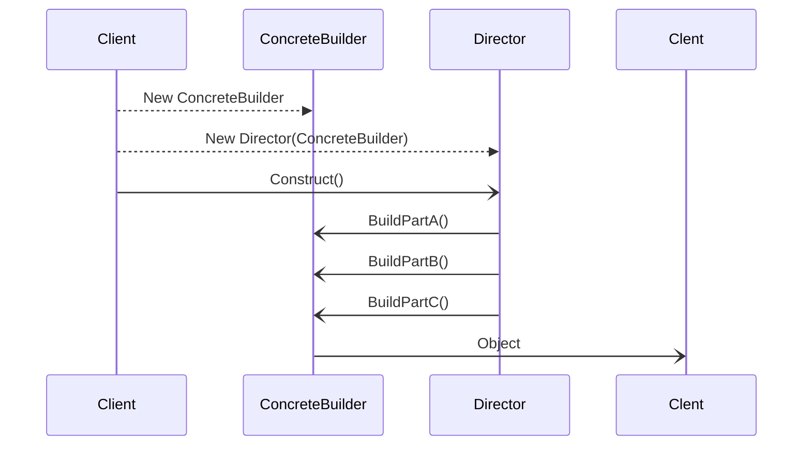

## Description

La construcción de un objeto complejo puede ser simplificado a través del builder
ya que encapsula la construcción en diferentes clases, lo cual permite la creación de diferentes representaciones de los objetos.

Un punto importante de este método es el hecho de crear los objetos paso a paso, en cambio otros patrones lo hacen de una sola vez

La lógica principal es "Separar la construcción compleja de un objeto en sus representaciones de manera que un mismo proceso de construcción pueda crear diferentes representaciones"

## Implementación

-  El proceso de construcción es dirigido por una clase llamada director
- El director usa una clase builder para ensamblar un objeto por partes
- Para crear diferentes objetos el director hace uso de distintas clases de builders.
- Todos los buildes pueden heredar de una clase base en común
- La clase base debe tener una interfaz apropiada para permitir la construcción de diferentes tipos de objetos en pasos.

## Fluent interfaz

- Se usa para simplificar el proceso de contrucción, los metodos de builder pueden ser encadenados juntos.
- Requiere de un metodo para retornar un instancia del builder
- Para crear el objeto se llama la fluent interfaz
- Despues de llamar el seteo de los estados, el cliente llama al metodo build para construir el objeto

## Pros

- Oculta la representación y la estructura de los productos
- Oculta como los productos son ensamblados
- Si se necesita un producto diferente , solo se define un nuevo builder
- Se separa el código del constructor y el como ees representado
- Brinda control sobre el proceso de contrucción de los objetos

## Contras

- Puede aumentar la complejidad del codigo

## Cuando usar

- Evitar tantos constructore