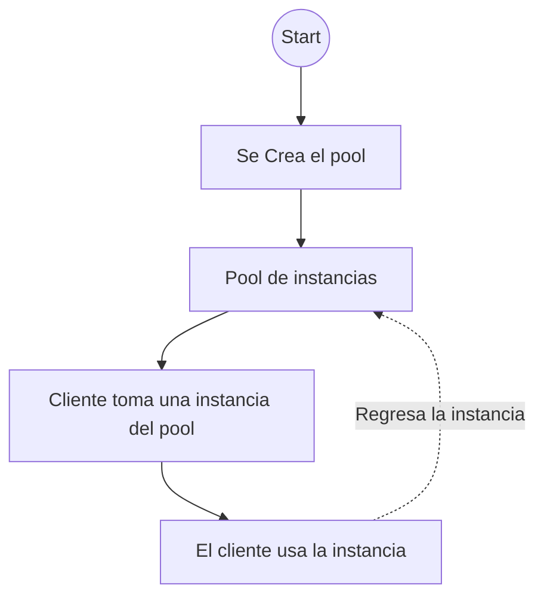

## Resume

Este no es oficialmente un patrón de diseño, su diferencia con el factory method radica 
en el hecho de que el factory method crea nuevas instancias, en cambio, el pool, usa
instancias ya creadas en el caché.

Especialmente util en los videojuegos, ya que la creación y destrucción constante de
objetos puede llevar a la fragmentación de memoria, por lo cual, el concepto de 
tener un pool de instancias, usar la que se necesita y cuando se termine de usar, 
regresarlo al pool.

Los objetos en el pool son construidos, cuando este se vacía, cuando no quedan objetos
y cuando  el programa es iniciado. En caso de necesitar más instancias, el pool puede
crecer de manera automática.

El pool puede ser implementado como un singleton o un monostae

