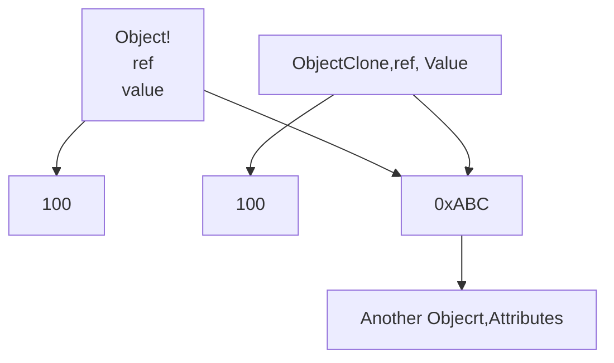
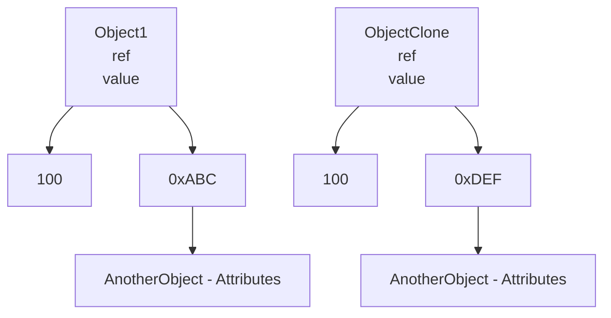

## Overview

Este es un patron diferente a todos los demas, si los demas retornaban instancias directas, este
patrón de diseño retorna una copia de la instancia llamada **prototipo**

Se tienen instancias prototipo de la cual se crean copias y se adecuan dependiendo del estado necesario
Esto es usado cuando la creación de una instancia demanda de un uso excesivo de recursos, por lo cual, 
resulta conveniente tener una copia de la cual se deriven los otros estados.

## Implementación

- Las clases que requieren ser clonadas heredan de una clase base común
- La clase de la cual se heredan provee un metodo virtual llamado clone
- El método clone puede ser sobreescrito por las subclases para crear copias de si mismo
- El cliente puede llamar este metodo para crear copias / clones de los proyectos existentes.
- Una vez clonado, el cliente puede cambiar el estado de ciertos objetos clonados
- Lass clases pueden tener metodos inicializadores//Setters

El clone method actua como un virtual copy constructor.

## Shallow Copy

- La implementación por defecto de esto es por medio del copy constructor, copia la referencia 
mas no la data
- The reference apunta a la misma dirección de memoria del objeto inicial

## Deep Copy

Todo lo demas es copiado de manera normal, sin embargo las referencias no se copian tal cual, se crea un nuevo espacio y se copian sus valores

## Pros

- Tiene todos los pros de los metodos de factory
- Las clases en concreto estan escondidas del cliente
- Los productos pueden ser agregados u eliminados en runtime
- Los nuevos objetos pueden ser definidos a través de la variación de valores

## Cons

- Todas las clases deben soportar la operación de clonación Clone()
- Dificil de implementar cuando las clases internamente tienen miembros que no soportan las copias como stream thread etc.

## Cuando usar 
- Reducción de dependencia de clases concretas
- Evitar jearquias paralelas de factories
- Las instancias de una misma classe tiene multiples variaciones en sus estados
- Definición dinámica de nuevos objetos en la aplicación..